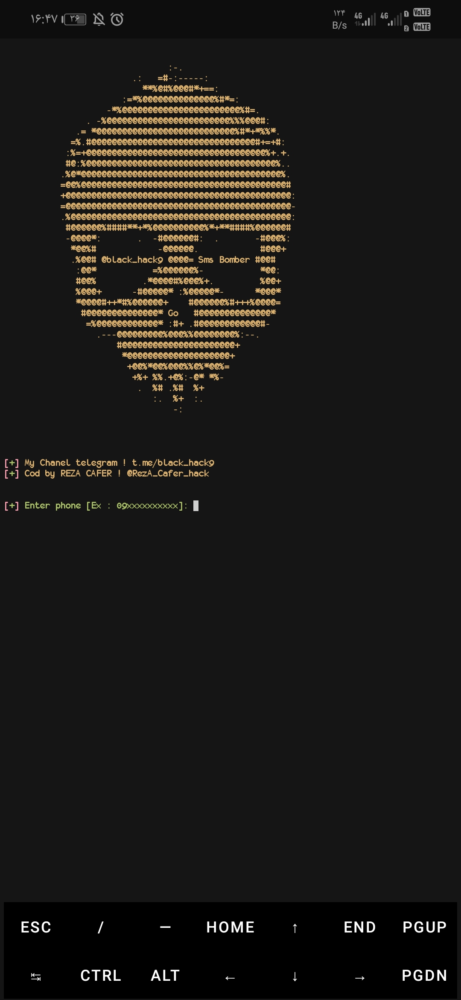

## screen shot


## Number of web services 
- Sms : 177 🧨
- Call : 6 🧨
## Run in Linux/Termux
```
git clone https://github.com/RezA85000/sms-bomber
cd sms-bomber
go run 'sms and call bomber.go'
```
